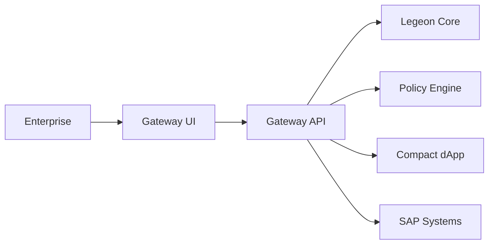

# Legeon Enterprise Gateway

The **Legeon Enterprise Gateway** is the enterprise-facing access point into the **Legeon Exchange Layer**.  
It delivers the Catalyst-funded **Source → Verify → Fulfill (S2F)** workflow module that allows enterprises to:

- Create and manage requisitions  
- Retrieve ranked shortlists from Legeon Core  
- Verify candidates with CompactDApp proofs and policy checks  
- Award engagements  
- Generate and approve Statements of Work (SoWs)  
- (Optional) Sync Award / SoW details to SAP systems  

This repository contains the technical design, documentation, adapters, and service modules required to implement the Gateway.

---

## 🚀 Catalyst-Funded Scope

The funded milestone covers the S2F lifecycle:

1. **Requisition Intake**  
2. **Shortlist Retrieval**  
3. **Candidate Verification**  
4. **Award Workflow**  
5. **SoW Creation & Approval**  
6. **Optional SAP Sync**  

⚠️ *Time tracking, milestones, invoices, and enterprise billing flows are out of scope for this Catalyst round.*

---

## 📚 Documentation Index

All architecture, APIs, diagrams, and specifications live in the [`/docs`](./docs) directory.

### **Core Technical Documents**

- **[Architecture Overview](./docs/architecture.md)**  
- **[API Overview & Sequence Diagram](./docs/api-overview.md)**  
- **[Privacy & Boundary Model](./docs/privacy-boundaries.md)**  
- **[SAP Integration Design](./docs/sap-integration-design.md)**  
- **[Roadmap (Catalyst Deliverables)](./docs/roadmap.md)**  
- **[Documentation Index](./docs/README.md)**  

---

## 🏛️ High-Level Architecture (Preview)



Full diagram & narrative available in  
👉 [docs/api-overview.md](./docs/api-overview.md)

---

## 📁 Repository Structure

```text
/
├── adapters-compactdapp/          # Client adapters for Genesis CompactDApp
├── adapters-core-ai/              # (If applicable) AI-based adapters
├── adapters-privacy-core/         # Privacy / Midnight integration adapters
├── config/                        # Environment templates + config
│   └── env.example
├── docs/                          # All technical documentation
│   ├── README.md
│   ├── api-overview.md
│   ├── architecture.md
│   ├── privacy-boundaries.md
│   ├── sap-integration-design.md
│   └── roadmap.md
├── gateway-services/              # Implementation of Gateway S2F service layer
│   └── README.md
├── gateway-ui/                    # Placeholder for UI module
│   └── README.md
├── integrations-sap/              # SAP integration clients & sync logic
│   └── README.md
├── infra/                         # Deployment / infrastructure
│   └── README.md
└── setup_structure.sh             # Used to scaffold repository structure
```

---

## 🧭 Getting Started (Developers)

1. **Clone the repository**

   ```bash
   git clone https://github.com/legeon-foundation/legeon-enterprise-gateway.git
   ```

2. **Copy environment template**

   ```bash
   cp config/env.example .env
   ```

3. **Populate required environment variables**

   - SAP endpoints / credentials  
   - Legeon Core endpoints  
   - CompactDApp endpoints  
   - Policy Engine endpoints  

4. **Run services**

   Instructions will be finalized upon implementation.

---

## 📌 Catalyst Deliverables (Summary)

| Deliverable             | Status       | Location                               |
|-------------------------|--------------|----------------------------------------|
| S2F Architecture        | ✅ Complete | `/docs/architecture.md`                |
| Sequence Diagram        | ✅ Complete | `/docs/api-overview.md`                |
| Privacy Boundary        | ✅ Complete | `/docs/privacy-boundaries.md`          |
| SAP Integration Outline | ✅ Complete | `/docs/sap-integration-design.md`      |
| Roadmap                 | ✅ Complete | `/docs/roadmap.md`                     |
| Repository Structure    | ✅ Complete | Root                                   |

---

## 🤝 Contributing

Community members may contribute via:

- Documentation contributions  
- Bug reports  
- SAP mock adapters  
- UX/UI research  

---

## 🛡️ License

TBD (based on Legeon Foundation licensing guidelines)

---

## 📬 Contact

For inquiries about the Enterprise Gateway or collaboration:

**Legeon Foundation**  
https://legeon.co


