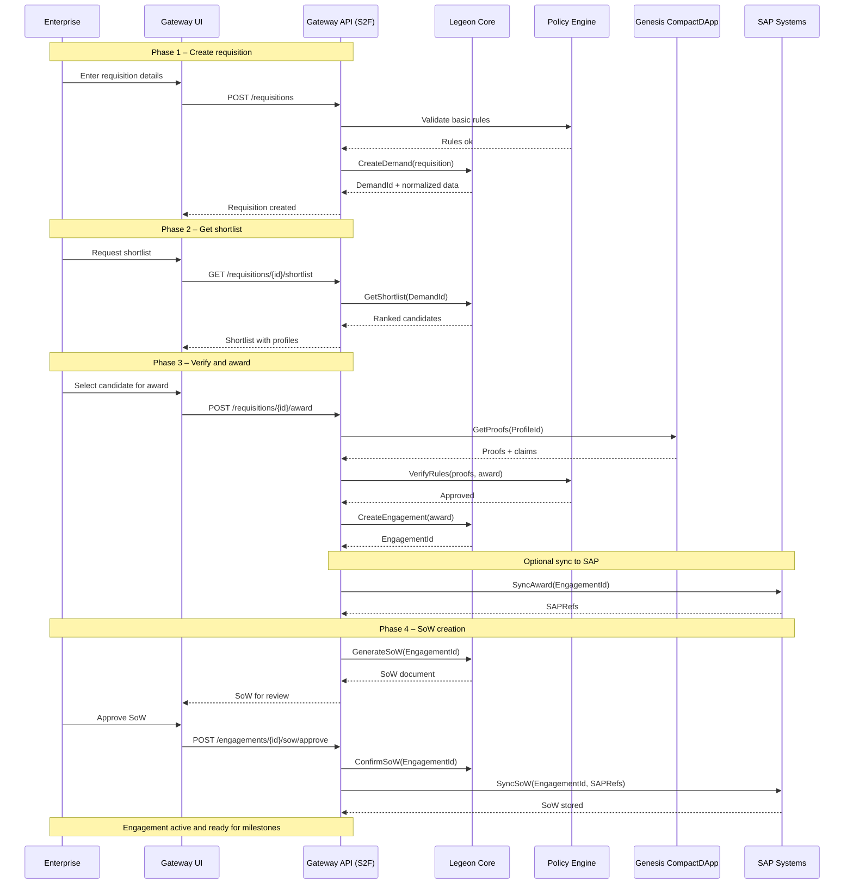

```mermaid
sequenceDiagram
  participant Enterprise as Enterprise
  participant GatewayUI as Gateway UI
  participant GatewayAPI as Gateway API (S2F)
  participant Core as Legeon Core
  participant Policy as Policy Engine
  participant Compact as Genesis CompactDApp
  participant SAP as SAP Systems

  Note over Enterprise,GatewayAPI: Phase 1 – Create requisition

  Enterprise ->> GatewayUI: Enter requisition details
  GatewayUI ->> GatewayAPI: POST /requisitions
  GatewayAPI ->> Policy: Validate basic rules
  Policy -->> GatewayAPI: Rules ok
  GatewayAPI ->> Core: CreateDemand(requisition)
  Core -->> GatewayAPI: DemandId + normalized data
  GatewayAPI -->> GatewayUI: Requisition created

  Note over Enterprise,GatewayAPI: Phase 2 – Get shortlist

  Enterprise ->> GatewayUI: Request shortlist
  GatewayUI ->> GatewayAPI: GET /requisitions/{id}/shortlist
  GatewayAPI ->> Core: GetShortlist(DemandId)
  Core -->> GatewayAPI: Ranked candidates
  GatewayAPI -->> GatewayUI: Shortlist with profiles

  Note over Enterprise,GatewayAPI: Phase 3 – Verify and award

  Enterprise ->> GatewayUI: Select candidate for award
  GatewayUI ->> GatewayAPI: POST /requisitions/{id}/award
  GatewayAPI ->> Compact: GetProofs(ProfileId)
  Compact -->> GatewayAPI: Proofs + claims
  GatewayAPI ->> Policy: VerifyRules(proofs, award)
  Policy -->> GatewayAPI: Approved
  GatewayAPI ->> Core: CreateEngagement(award)
  Core -->> GatewayAPI: EngagementId

  Note over GatewayAPI,SAP: Optional sync to SAP

  GatewayAPI ->> SAP: SyncAward(EngagementId)
  SAP -->> GatewayAPI: SAPRefs

  Note over Enterprise,SAP: Phase 4 – SoW creation

  GatewayAPI ->> Core: GenerateSoW(EngagementId)
  Core -->> GatewayAPI: SoW document
  GatewayAPI -->> GatewayUI: SoW for review
  Enterprise ->> GatewayUI: Approve SoW
  GatewayUI ->> GatewayAPI: POST /engagements/{id}/sow/approve
  GatewayAPI ->> Core: ConfirmSoW(EngagementId)
  GatewayAPI ->> SAP: SyncSoW(EngagementId, SAPRefs)
  SAP -->> GatewayAPI: SoW stored

  Note over Enterprise,GatewayAPI: Engagement active and ready for milestones
```

