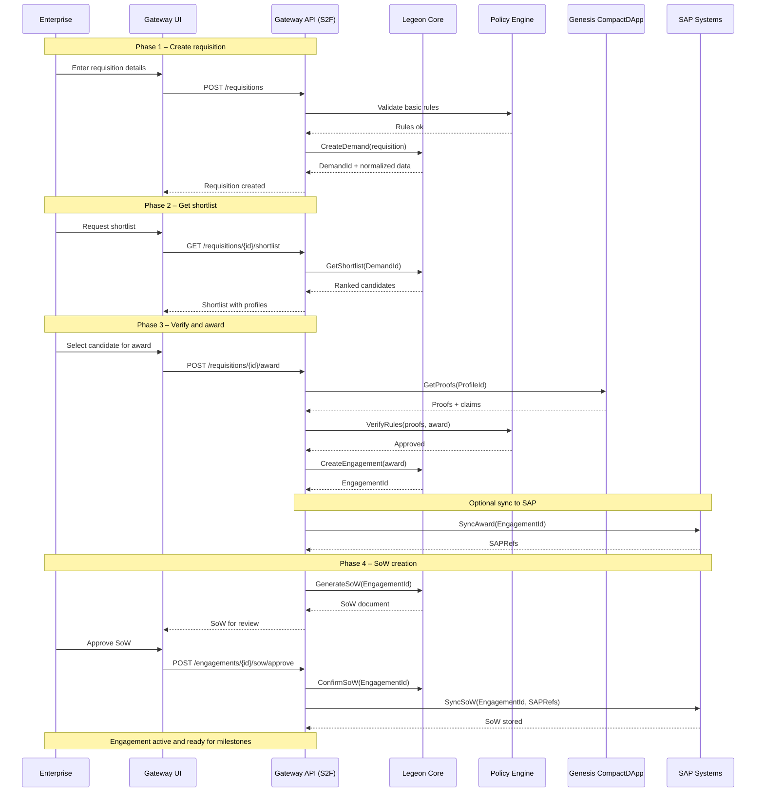

End-to-End Workflow Narrative: Requisition → Shortlist → Award → SoW (S2F)
Requisition → Shortlist → Award → SoW (S2F) — Narrative

The S2F lifecycle represents the end-to-end process for matching enterprise SAP consulting demand with verified Legeon consultants. The Enterprise Gateway orchestrates this flow by coordinating between the Gateway UI, the Gateway API (S2F orchestrator), Legeon Core, the Policy Engine, Genesis CompactDApp, and optional downstream SAP systems (Ariba, Fieldglass, S/4HANA).

The flow is split into four major phases:

Phase 1 — Create Requisition

An enterprise stakeholder begins by submitting a new requisition through the Gateway UI. The Gateway API validates basic business rules through the Policy Engine, normalizes demand details, and creates a standardized DemandId inside Legeon Core.
Outcome: A normalized requisition is created and is ready for shortlisting.

Phase 2 — Get Shortlist

Once the requisition is created, the enterprise user requests a shortlist. The Gateway API retrieves ranked consultant candidates from Legeon Core. Rankings are based on skills, experience proofs, availability, policy constraints, and (optionally) historical performance.
Outcome: A shortlist with profile summaries is returned to the Gateway UI.

Phase 3 — Verify and Award

The enterprise user selects a preferred consultant. Before awarding, the Gateway API retrieves cryptographic proofs (e.g., skills, certifications, work history) from the consultant’s Genesis CompactDApp profile. The Policy Engine verifies compliance rules (geo restrictions, skill match, rate rules, SoD constraints).
Upon approval, Legeon Core creates an EngagementId.
Outcome: A verified award is created and (optionally) synchronized with SAP.

Phase 3.5 — Optional SAP Sync

If the enterprise has SAP Ariba/Fieldglass/S4 integration enabled, the Gateway API syncs the award to SAP systems. SAP returns integration references that are stored with the engagement.
Outcome: SAP becomes aware of the awarded engagement, enabling downstream procurement workflows.

Phase 4 — Statement of Work (SoW)

The Gateway API generates a SoW draft from the engagement details (scope, milestones, deliverables, rates).
The enterprise reviews and approves the SoW through the Gateway UI.
Once approved, the SoW is confirmed in Legeon Core and optionally synchronized back to SAP.
Outcome: A formalized, approved SoW ready for milestone tracking and delivery.

